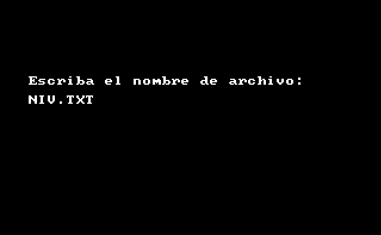

### Kevin Ernesto García Hernández | 202113553
# Manual de Usuario

Este es un documento que proporciona información detallada sobre cómo utilizar una aplicación o software. Su objetivo principal es ayudar a los usuarios a comprender las funciones y características de la aplicación y a utilizarlas de manera efectiva. El manual de usuario proporciona instrucciones paso a paso para realizar tareas específicas dentro del software, lo que permite al usuario resolver problemas y realizar tareas complejas de manera sencilla. Este documento también puede incluir información sobre los requisitos del sistema, la instalación del software y las soluciones a problemas comunes. En resumen, un manual de usuario es una herramienta esencial para garantizar que los usuarios puedan utilizar una aplicación o software de manera efectiva y obtener el máximo beneficio de sus características y funcionalidades.

## Recursos Necesarios

Para instalar y ejecutar la aplicación es necesario tener los siguientes requisitos de software:

- DOSBox: Es un emulador de DOS que te permite ejecutar programas de DOS en sistemas operativos modernos. Necesitarás instalar DOSBox en tu computadora para ejecutar y probar el programa ensamblador.

- Programa ensamblador: Debes tener el programa ensamblador en formato ejecutable o binario (.exe o .com) listo para ser ejecutado. Este programa puede ser escrito en lenguaje ensamblador utilizando MASM y luego ensamblado para generar el archivo ejecutable.

- Archivos de entrada: Si el programa ensamblador requiere archivos de entrada (por ejemplo, datos de entrada para realizar cálculos o procesamientos), asegúrate de tener esos archivos listos y accesibles en el sistema de archivos de DOSBox.

## Utilización

A continuación se darán unos pasos para poder utilizar la aplicación:

- Abrir DOSBox en tu sistema.

- Montar la carpeta o directorio que contiene el programa ensamblador y los archivos de entrada en la unidad virtual de DOSBox.

- Utilizar los comandos de DOSBox para navegar hasta el directorio donde se encuentra el programa ensamblador.

- Ejecutar el programa ensamblador utilizando el comando correspondiente en DOSBox. Por ejemplo, si el programa se llama "programa.exe", puedes escribir "programa.exe" en el prompt de DOSBox y presionar Enter para ejecutarlo.

- Una vez ya dentro, se puede jugar con el programa ensamblador y los archivos de entrada para ver cómo funciona.

## Descripción 
El programa es un juego, en este caso es un Sokoban. 

Sokoban es un juego de lógica en el que el jugador controla a un personaje que debe empujar cajas hasta una ubicación específica en un mapa. El jugador puede moverse en cuatro direcciones (arriba, abajo, izquierda y derecha) y empujar las cajas en la misma dirección en la que se mueve. El jugador gana el juego cuando todas las cajas se colocan en las ubicaciones objetivo. El jugador pierde el juego si empuja una caja hacia una pared o hacia otra caja. El jugador también puede perder el juego si empuja una caja hacia una ubicación que no sea la ubicación objetivo. El juego termina cuando el jugador gana o pierde.

## Juego
Al iniciar el programa contarás con lo siguiente pantalla:

### Menú Principal  
Una vez iniciada la sesión, se mostrará el siguiente menú:

Este menú contando con la opción de **Nuevo Juego**, **Cargar Nivel**, **Configuración**, **Tabla de Puntuaciones** y **Salir**. Las opciones se podrán seleccionar con las teclas de dirección y la tecla **Enter**.

### Nuevo Juego
Al seleccionar la opción de **Nuevo Juego** se cargará los niveles que se encuentren en los archivos llamados *NIV.00*, *NIV.01* y *NIV.10*.

Mostrándose de la siguiente manera un nivel:

Mostrandose el nivel en pantalla, un contador del tiempo que está jugando y el número de movimientos que ha realizado. La jugador se podrá mover con las teclas de dirección y la tecla **F2** para abrir el menú de pausa.

Una vez ganado el nivel 1 se pasará al nivel 2, y así sucesivamente hasta el nivel 3.

### Cargar Nivel
Al seleccionar la opción de **Cargar Nivel** se mostrará lo siguiente:

Donde se podrá escribir el archivo a cargar que contenga el nivel que se desea jugar. Este es el ejemplo de un nivel una vez cargado:

### Configuración
Esta opción se podrán configurar los controles del juego a usar.

### Tabla de Puntuaciones
Esta opción se mostrará las puntuaciones de los jugadores que han jugado el juego (de los primeros diez).

### Pausa

Como se dijo anteriormente, se podrá acceder al menú de pausa con la tecla **F2**. Este menú se mostrará de la siguiente manera:

Este menú contando con la opción de **Continuar** y **Salir**. Las opciones se podrán seleccionar con las teclas de dirección y la tecla **Enter**.